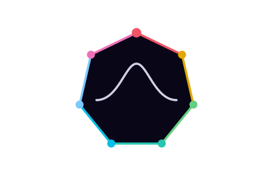

# ✦ Varium ✦

### *An atmospheric luxury dark theme built in OKLCH.*

A deep violet-blue colorscheme designed for clarity, depth, and elegance.

 

 

 

✦ ✦ ✦

 

## ✦ Overview

Varium is a dark colorscheme focused on deep violet-blue neutrals and clear semantic accents. It
aims for a rich, immersive feel without relying on neon colors, glossy effects, or flat grays
Because it's built entirely in OKLCH, the colors are perceptually uniform, keeping contrast and
brightness consistent across the entire palette.

*Every part of this project — the OKLCH palette, the logo, and the documentation — was built through AI-assisted iteration, directed and refined toward a specific design vision. Primarily a personal project; issues and PRs are welcome, but responses may be slow.*

---

## ✦ Philosophy

>Depth over darkness
>Backgrounds use deep violet-blues to create a sense of space, avoiding flat, lifeless black or gray.

>Temperature as meaning
>Cool colors (blues/teals) make up the structure, while warm colors (reds/yellows) highlight behavior and grab attention.

>Perceptual balance
>colors are tuned for how the eye actually sees them, keeping contrast consistent and preventing one accent from overpowering the rest.

>Restraint
>No unnecessary gradients, glows, or clutter. The focus is on a clean, readable environment.

---

## ✦ Palette

### Backgrounds

| Token | Hex       |
| ----- | --------- |
| `bg0` | `#090618` |
| `bg1` | `#0f0e1f` |
| `bg2` | `#181728` |
| `bg3` | `#222231` |

---

### Foregrounds

| Token | Hex       |
| ----- | --------- |
| `fg0` | `#e3e2f6` |
| `fg1` | `#afafbf` |
| `fg2` | `#7e7f8b` |
| `fg3` | `#54545d` |

---

### Accents — Warm

| Token     | Hex       |
| --------- | --------- |
| `crimson` | `#f05465` |
| `amber`   | `#ffa052` |
| `gold`    | `#e2a700` |
| `rose`    | `#ed71b6` |

---

### Accents — Bridge

| Token  | Hex       |
| ------ | --------- |
| `jade` | `#64cf80` |
| `iris` | `#bf97ff` |

---

### Accents — Cool

| Token        | Hex       |
| ------------ | --------- |
| `teal`       | `#29c4b1` |
| `glacier`    | `#06bfe7` |
| `periwinkle` | `#7dc9ff` |

---

## ✦ Semantic Model

Varium organizes visual meaning by **temperature**, not category:

* **Warm** → Behavior — things that happen, demand attention, or invite action
* **Bridge** → Transition — accents that sit between pure structure and pure behavior
* **Cool** → Structure — things that inform, organize, or recede

---

## ✦ Ports

Current and planned ports:

* [Neovim](https://github.com/BitSwapped/varium.nvim)
* VSCode
* Terminal Emulators
* Hyprland
* GTK
* Qt

Contributions for additional ports are welcome.

---

## ✦ Contributing

Contributions are welcome—especially for new ports, refinements, and integrations.

1. Fork the repository
2. Create a feature branch
3. Submit a pull request

---

## ✦ License

Varium is released under the [MIT License](./LICENSE).

 

Built with precision in OKLCH.

✦ Varium ✦

